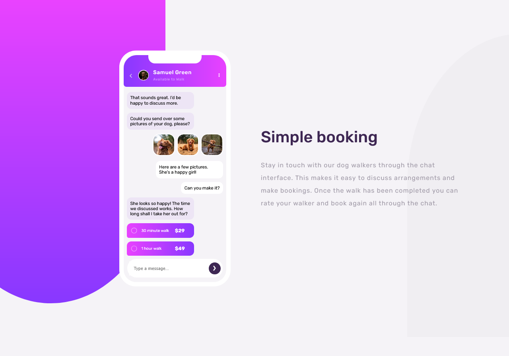
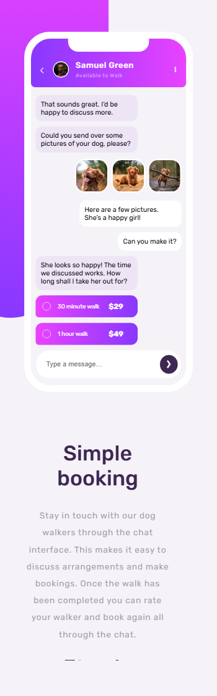

# Frontend Mentor - Chat app CSS illustration solution

This is a solution to the [Chat app CSS illustration challenge on Frontend Mentor](https://www.frontendmentor.io/challenges/chat-app-css-illustration-O5auMkFqY). Frontend Mentor challenges help you improve your coding skills by building realistic projects. 

## Overview

### The challenge

I made a live chat app with screen of conversation.

### Screenshot

### Links

- Solution URL: [Frontend Mentor](https://www.frontendmentor.io/solutions/chat-app-with-css-lbdLZBZOpi)
- Live Site URL: [Vercel](https://chat-app-css-illustration-xi-nine.vercel.app/)

## My process

### Built with

- Semantic HTML5 markup
- CSS custom properties
- CSS Flexbox, Grid
- Mobile-first workflow using media query
- Used local stored fonts

## Author

- Frontend Mentor - [@sohanurshadhin](https://www.frontendmentor.io/profile/sohanurshadhin)
- Instagram - [@SohanurShadhinn](https://www.instagram.com/sohanurshadhin/)
- LinkedIn - [@sohanurshadhin](https://www.linkedin.com/in/sohanurshadhin/)
- X - [@SohanurShadhinn](https://x.com/SohanurShadhinn)
